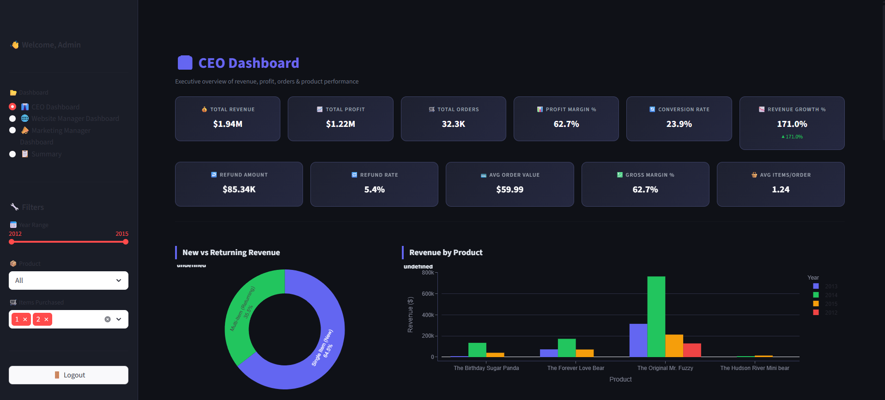

📊 Digital Analytics Project – E-Commerce Business Intelligence Dashboard

  

This project builds a Business Intelligence and Digital Analytics Dashboard for a newly launched e-commerce startup selling stuffed animal toys.

The objective is to analyze website traffic, marketing performance, product sales, and customer behavior to help stakeholders make data-driven decisions and support the company’s next round of funding.

🚀 Business Context

The company’s CEO wants to present a data-driven growth story to investors.

To support this, the analytics team built dashboards and analytical reports for multiple stakeholders.

Stakeholders

Cindy Sharp — CEO

Morgan Rockwell — Website Manager

Tom Parmesan — Marketing Manager

Each stakeholder requires different KPIs and analytical insights.

🎯 Project Objectives

The analytics team is responsible for:

Building stakeholder dashboards

Tracking key business KPIs

Performing deep performance analysis

Generating investor-ready insights

Key analytical areas include:

Traffic analysis

Website performance

Product performance

Cross-sell analysis

Marketing channel analysis

Customer behavior insights

👔 Stakeholder Dashboards
CEO Dashboard

Focus: Business Performance & Growth

KPIs:

Revenue

Profit

Profit Margin

Average Order Value

Refund Rate

Revenue Growth

Key analyses:

Product level sales

Product launch performance

Cross-sell analysis

Portfolio expansion analysis

Product refund analysis

Traffic sources and seasonality

🌐 Website Manager Dashboard

Focus: Website Performance & Conversion Optimization

KPIs:

Top website pages

Entry pages

Bounce rate

Conversion rate

Revenue per session

Session trends

Key analyses:

Landing page performance

Conversion funnel analysis

A/B testing for billing pages

Product pathing analysis

Website traffic trends

📣 Marketing Manager Dashboard

Focus: Marketing Channel Performance

KPIs:

Gsearch conversion rate

Traffic volume trends

Repeat visitors

Repeat session rate

Key analyses:

Traffic source trends

Channel performance comparison

Marketing bid optimization

Repeat visitor behavior analysis

📊 Dashboard Preview

The interactive dashboard allows stakeholders to monitor performance and explore insights in real time.

  

🗄 Dataset Description

The project uses an E-commerce database with multiple related tables.

Dataset	Description
orders.parquet	Order level data including revenue, cost, and product purchased
order_items.parquet	Individual product items within orders
order_item_refunds.parquet	Refund details for returned items
products.parquet	Product catalog information
website_sessions.parquet	Website traffic source data
website_pageviews.parquet	Page level website activity
📊 Key Analytics Performed
Traffic Analysis

Source breakdown

Device analysis

Channel performance

Conversion Analysis

Conversion funnels

Landing page testing

Checkout performance

Product Analysis

Product level revenue

Product launch performance

Cross-sell performance

Customer Analysis

Repeat visitors

Session patterns

Purchase behavior

📓 Deep Analysis Notebook

A detailed Jupyter notebook analysis was performed to generate insights used in the investor pitch deck and dashboards.

The notebook includes:

Exploratory Data Analysis (EDA)

Traffic and marketing analysis

Funnel conversion analysis

Product performance analysis

Cross-sell and bundling insights

Experimentation and A/B testing insights

📓 Notebook
analysis/pitch_deck_analysis.ipynb

📊 Investor Pitch Deck

The project includes an investor-ready pitch deck presenting the business growth story and strategic insights derived from the analysis.

Key topics covered:

Revenue and order growth trends

Customer acquisition performance

Product portfolio expansion

Cross-sell opportunities

Marketing efficiency

Investment opportunities

📄 Pitch Deck
assets/pitch_deck.pdf

📋 Project Management (JIRA)

Project development followed an Agile workflow managed using JIRA.

Activities included:

Sprint planning

Task assignment and tracking

Team coordination

Progress monitoring

JIRA task tracking file:

docs/jira_details.csv

🛠 Tech Stack
Technology	Purpose
Python	Data processing & analysis
Streamlit	Dashboard development
Pandas	Data manipulation
NumPy	Numerical computations
Plotly	Interactive visualizations
JIRA	Project management
📂 Project Structure
digital-analytics-project
│
├── app.py
│
├── dataset/
│   ├── orders.parquet
│   ├── order_items.parquet
│   ├── order_item_refunds.parquet
│   ├── products.parquet
│   ├── website_sessions.parquet
│   └── website_pageviews.parquet
│
├── analysis/
│   └── pitch_deck_analysis.ipynb
│
├── assets/
│   ├── preview.png
│   └── pitch_deck.pdf
│
├── docs/
│   └── jira_details.csv
│
├── requirements.txt
└── README.md
⚙️ Installation

Clone the repository

git clone https://github.com/YOUR_USERNAME/digital-analytics-project.git

Navigate to project folder

cd digital-analytics-project

Install dependencies

pip install -r requirements.txt

Run the Streamlit dashboard

streamlit run app.py
🔐 Login Credentials

Default login credentials for the dashboard:

Username: admin
Password: admin123
📈 Expected Outcome

This dashboard helps stakeholders:

Monitor company growth

Optimize marketing performance

Improve website conversion

Analyze customer behavior

Support investor presentations

👥 Team & Contributions
Abhishek Kumar Pandey — Team Lead

Responsibilities:

Project architecture design

Data analysis and business insights

KPI framework development

Investor pitch deck creation

Strategic recommendations

JIRA project coordination

GitHub documentation

Harsh

Data visualization and insight presentation

Funnel and traffic analysis

Revenue trend visualization

Streamlit dashboard development

Komal Dubey

Data cleaning and preparation

Exploratory data analysis

Product and marketing performance analysis

Power BI dashboard development

👨‍💻 Author

Abhishek Kumar Pandey

Data Science & Analytics Enthusiast